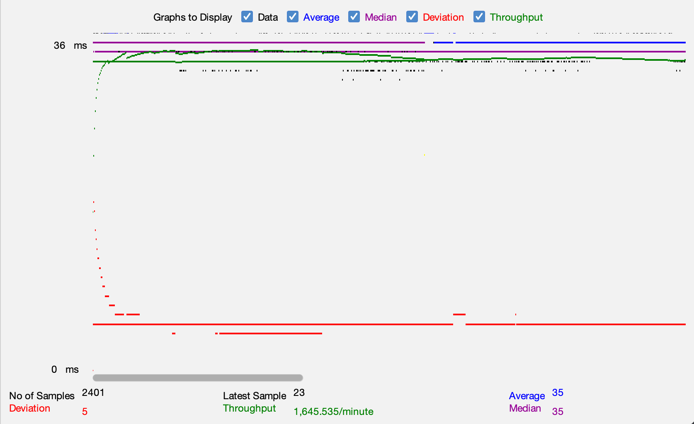
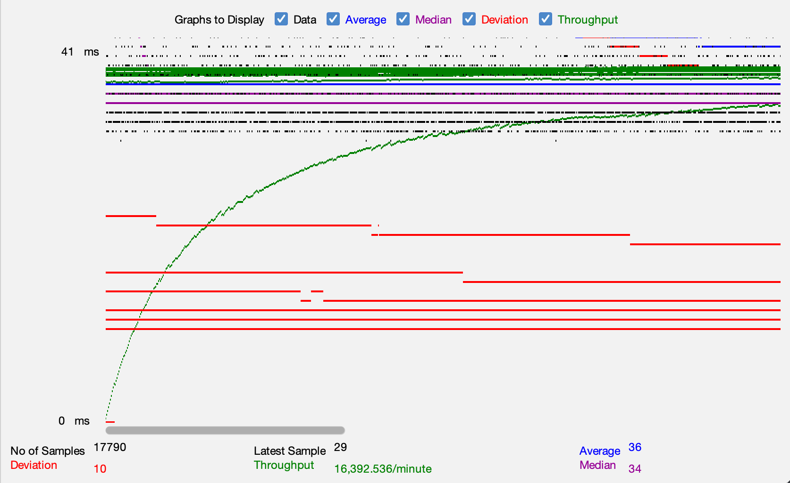
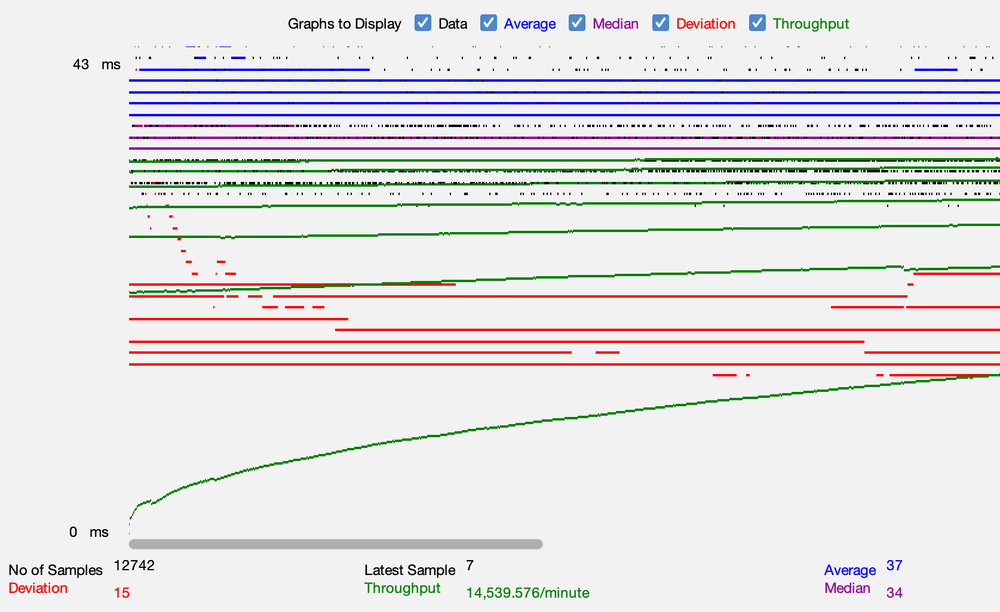
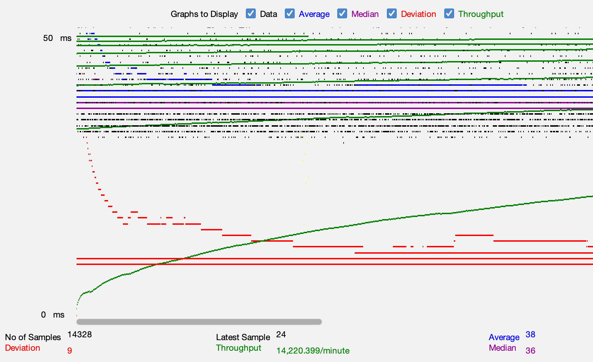
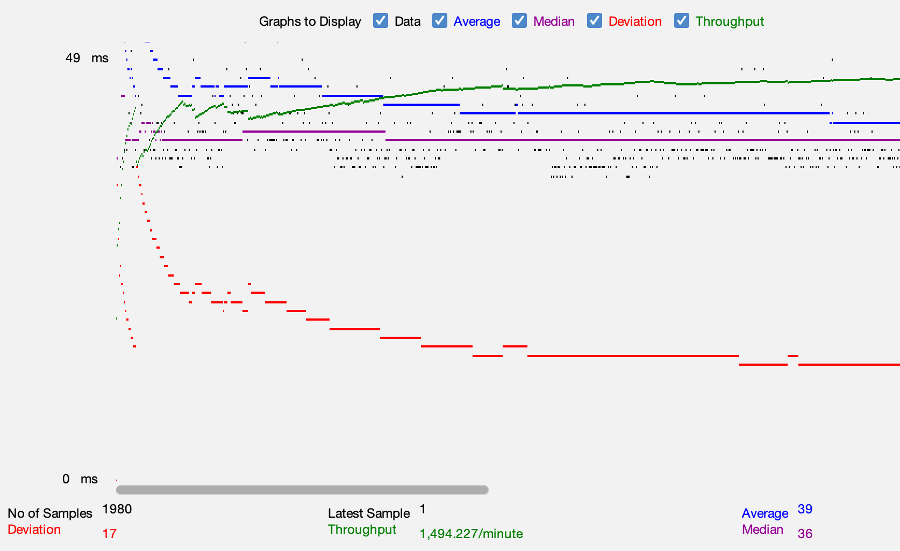
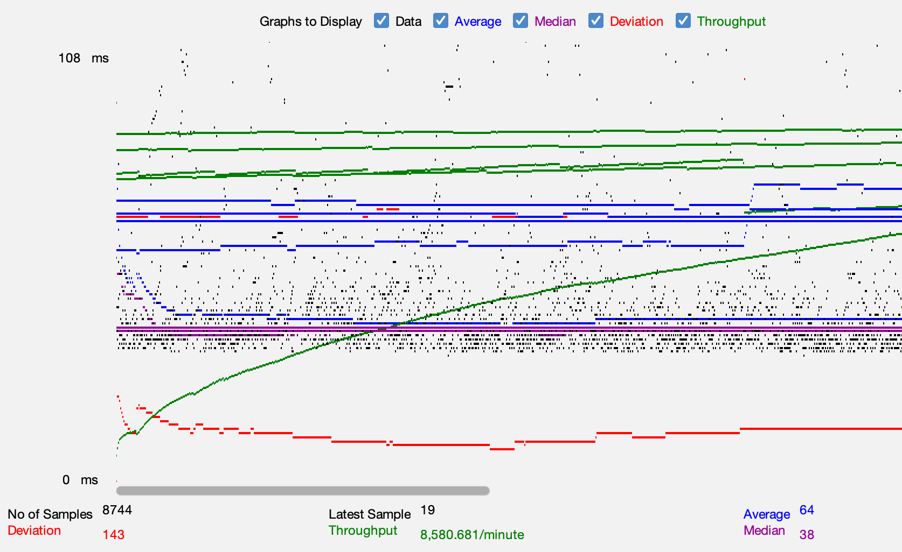
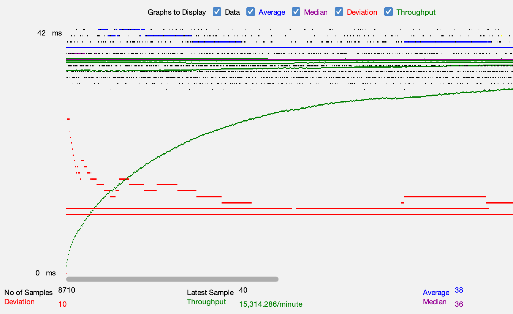

- # General
    - #### Team#: 46

    - #### Names: Jonathan Chen, Sean Konaka

    - #### Project 5 Video Demo Link: [Project 5 Recording](https://youtu.be/bY4q75N4bqI)

    - #### Instruction of deployment:
      - ##### Requirements:
        - MySQL 8.0.30
        - JDK 11.0.16
        - Java Servlets 3.1.0
        - Tomcat 9
        - Maven 3.8.6
        - AWS (Ubuntu Server 20.04)
        - Apache2
      -  ##### Steps:
         1. Ensure public IP of Master Server is the same as the one listed in `cs122b-fall-team-46/web/META-INF/context.xml`
         2. `show master status` in Master Server's MySQL, take note of MASTER_LOG_FILE and MASTER_LOG_POS
         3. In Slave Server, change MySQL master to Master Server's private IP, using the Master Server's MASTER_LOG_FILE and MASTER_LOG_POS
         4. Restart Apache2 on Load Balancer Server
         5. Clone the repository: `git clone https://github.com/uci-jherold2-teaching/cs122b-fall-team-46.git` into every AWS server.
         6. Create and populate a `moviedb.sql` file on Master Server
         7. `mvn package` in the repository folder of every server
         8. `cp ./target/*.war /var/lib/tomcat9/webapps/` the .war into tomcat
         9. Encrypt existing user and employee password with  `mvn compile`  `mvn exec:java -Dexec.cleanupDaemonThreads=false -Dexec.mainClass="UpdateSecurePassword"`
         10. Site should now be up. Connect to `[Load Balancer's Public IP]:80` for Scaled server, or `:8080` for Single Instance

    - #### Collaborations and Work Distribution:
      - ##### Jonathan:
        - JMeter Test Plans
        - Connection Pooling
      - ##### Sean:
        - Master-Slave Configuration
        - Apache2 Setup

- # Connection Pooling
    - #### Include the filename/path of all code/configuration files in GitHub of using JDBC Connection Pooling.
      - cs122b-fall-team-46/web/META-INF/context.xml
      - cs122b-fall-team-46/web/WEB-INF/web.xml
      - cs122b-fall-team-46/src/BrowseServlet.java
      - cs122b-fall-team-46/src/DashboardLoginServlet.java
      - cs122b-fall-team-46/src/DashboardServlet.java
      - cs122b-fall-team-46/src/LoginServlet.java
      - cs122b-fall-team-46/src/MovieListServlet.java
      - cs122b-fall-team-46/src/MovieServlet.java
      - cs122b-fall-team-46/src/PaymentServlet.java
      - cs122b-fall-team-46/src/StarServlet.java

    - #### Explain how Connection Pooling is utilized in the Fabflix code.
        - A stockpile reserve or "pool" of connections are initialized beforehand in Tomcat by the .xml configurations.
          Any servlet requiring a connection that calls .getConnection() at runtime will now lease an existing connection from
          this pool instead of initializing a new connection at runtime. When out of scope, the connection is returned
          to Tomcat to be reused. MovieListServlet.java is one such servlet benefiting from Connection Pooling
    
    - #### Explain how Connection Pooling works with two backend SQL.
        - Each backend SQL has two connection pools dedicated for Read requests and for Read/Write requests.
          The Read/Write pool has an IP target set for the Master SQL server to facilitate data replication, since 
          only the Master SQL server is supposed to perform Write statements.

- # Master/Slave
    - #### Include the filename/path of all code/configuration files in GitHub of routing queries to Master/Slave SQL.
        - cs122b-fall-team-46/web/META-INF/context.xml
        - cs122b-fall-team-46/web/WEB-INF/web.xml
        - cs122b-fall-team-46/src/DashboardServlet.java
        - cs122b-fall-team-46/src/Payment.java

    - #### How read/write requests were routed to Master/Slave SQL?
        - Each backend Tomcat server has two pools: one for Read requests and one for Read/Write requests. Read request
       connections are connected to the localhost SQL server (the same SQL server as on that particular Tomcat) while
       Read/Write connections are designated for the IP:Port of the SQL server on the Master server instance. This means
       all reads are handled on each instance's own SQL server, while all writes are routed to the Master instance's SQL.
       Read requests are given connections from the first aforementioned pool, while Read/Write requests are assigned the
       second.

- # JMeter TS/TJ Time Logs
    - #### Instructions of how to use the `log_processing.*` script to process the JMeter logs.
        1. The `log_processing.py` file can be found in cs122b-fall-team-46/logs (based on assumption)
        2. Move `log_processing.py` into the same directory as the text file you want to process
        3. Open the terminal and traverse into the same directory
        4. Execute `python3 log_processing.py` and follow the prompts (you may omit ".txt" when typing the text file's name)

- # JMeter TS/TJ Time Measurement Report

| **Single-instance Version Test Plan**          | **Graph Results Screenshot**        | **Average Query Time(ms)** | **Average Search Servlet Time(ms)** | **Average JDBC Time(ms)** |
|------------------------------------------------|-------------------------------------|----------------------------|-------------------------------------|---------------------------|
| Case 1: HTTP/1 thread                          |  | 35                         | 1.886                               | 1.644                     |
| Case 2: HTTP/10 threads                        |  | 36                         | 2.750                               | 2.616                     |
| Case 3: HTTPS/10 threads                       |  | 37                         | 3.652                               | 3.382                     |
| Case 4: HTTP/10 threads/No connection pooling  |  | 38                         | 4.170                               | 3.178                     |

| **Scaled Version Test Plan**                   | **Graph Results Screenshot**        | **Average Query Time(ms)** | **Average Search Servlet Time(ms)** | **Average JDBC Time(ms)** |
|------------------------------------------------|-------------------------------------|----------------------------|-------------------------------------|---------------------------|
| Case 1: HTTP/1 thread                          |  | 39                         | 3.609                               | 3.137                     |
| Case 2: HTTP/10 threads                        |  | 64                         | 4.629                               | 4.412                     |
| Case 3: HTTP/10 threads/No connection pooling  |  | 38                         | 3.612                               | 3.093                     |